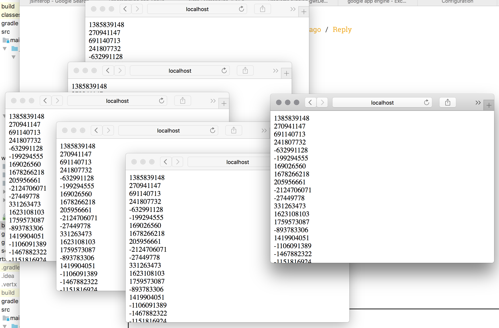

= Connecting a GWT eventbus to a Vert.X eventbus
Michael van Niekerk 

== What we're aiming for
In this tutorial we're first going to create a Vert.X service. This service has a verticle that is exposing a topic on the Vert.X event bus to a (CORS-enabled SockJS) eventbus bridge.

After that, we're wiring a GWT application's eventbus up to this eventbus stream and display all these received messages. We'll be using JsInterop annotated classes to use the Vert.X client javascript libraries. 

In all it is an introduction to Vert.X, to create custom GWT events and to use GWT's latest JsInterop to glue these two frameworks together.

.Verticle what?
[TIP]
====
Vert.X is a Reactive framework that uses an eventbus. The smaller components of a Vert.X app then listens to this eventbus and reacts to the events on the bus. They are thus small services being part of the big service - verticles. This is sometimes referred to as a Microservices 2.0 architecture.
====

== Technology used
Gradle for builds - both for the GWT application and the Vert.X service. 

Vert.X needs Java 8. I've used Groovy to make the Vert.X application - but you can use any of Vert.X's language bindings. The tutorial uses version 3.3.3 of Vert.X.

The tutorial uses the 2.8 version of GWT. This brings JsInterop about and some Java 8 language features - like lambdas, which we'll be using.

.JsInterop
[TIP]
====
JsInterop is a way for GWT applications to map existing Javascript libraries to annotated GWT Java classes. It also allows GWT application classes to be used in Javascript libraries. 
====

== The Vert.X service

=== Building the Vert.X service
You can install and run Vert.X using the excellent sdkman tool. For now, I'm just running it as a JavaExec task.

.build.gradle
[source,groovy]
----
apply plugin: 'groovy'  //<1>

repositories {
    mavenLocal()
    jcenter()
}

dependencies {
    compile 'io.vertx:vertx-core:3.3.3'
    compile 'io.vertx:vertx-web:3.3.3'
    compile 'org.codehaus.groovy:groovy-all:2.4.7'
}

task run(type: JavaExec) {
    main = "za.co.dvt.jhb.vertxsockjs.VertxSockJsServer"    //<2>
    classpath = sourceSets.main.runtimeClasspath
}

----

<1> Apply the Groovy plugin
<2> A JavaExec task, to run the service straight from the gradle build.

=== The main class
Our main class sets up the Vert.X instance, deploys our verticle (that bridges the topic on the eventbus to a SockJS port). It also then sets up a periodic timer that fires a random integer number every second to the "randomnumber" topic. A consumer is then added to print out the random number from the topic onto stdout.

.VertxSockJsServer.groovy
[source,groovy]
----
package za.co.dvt.jhb.vertxsockjs

import io.vertx.core.Vertx
import io.vertx.core.eventbus.Message

class VertxSockJsServer {
    static void main(args) {
        def v = Vertx.vertx()
        v.deployVerticle new RandomNumberPusherVerticle(), {
            println "Deployed"
        }   //<1>

        v.setPeriodic 1000, { id ->
            v.eventBus().publish "randomnumber", new Random().nextInt()
        } //<2>

        v.eventBus().consumer "randomnumber", { Message<Integer> s ->
            println "Next number ${s.body()}"
        } //<3>
    }
}

----
<1> Deploy our verticle, with a listener upon finished
<2> Create the timer and publish to the event bus
<3> Consume everything from the "randomnumber" topic, and print out to stdout

=== The SockJS bridge
.RandomNumberPusherVerticle.groovy
[source,groovy]
----
package za.co.dvt.jhb.vertxsockjs

import io.vertx.core.AbstractVerticle
import io.vertx.ext.web.Router
import io.vertx.ext.web.handler.sockjs.BridgeOptions
import io.vertx.ext.web.handler.sockjs.PermittedOptions
import io.vertx.ext.web.handler.sockjs.SockJSHandler

class RandomNumberPusherVerticle extends AbstractVerticle {
    @Override
    void start() throws Exception {
        
        def sjs = SockJSHandler.create vertx bridge withBridge, {event ->
            event.complete true
        }   //<1>
        sjs.socketHandler { ev ->
            ev.headers().add("Access-Control-Allow-Origin", "*")
        } //<2>
        def router = Router.router vertx    //<3>
        router.route "/randomnumber/*" handler sjs <4>

        def port = 9999
        println "Binding to port $port"
        vertx.createHttpServer().requestHandler router.&accept listen port  //<5>
    }

    static getWithBridge() {
        new BridgeOptions()
            .addOutboundPermitted(new PermittedOptions(address: "randomnumber")) //<6>    
    }
}

----

<1> Setup a SockJS protocol handler, bridge it with a bridge, and get asked upon each event wether the event from the eventbus must be propagated to the SockJS socket.
<2> This is to add a CORS header.
<3> Make a new router
<4> Route the router to the SockJS handler for any address http:<host instance>/randomnumber
<5> Bind to the port and start listening
<6> Eventbus bridge options. We're only allowing "randomnumber" for outbound events. With the bridge options you can also add authentication and inbound directives.

=== Running the service
You can run the service from the build script:
----
gradle run
----

== The GWT client
The GWT client is a bit more involved.
We're going to create an event handler interface for any GWT eventbus listener that wants to listen to these new random number events. Also what is needed is to create a custom GWT event type from which the GWT event bus is going to use to dispatch these events to its listeners.

Lastly the glue between GWT's Java world and the Vert.X Eventbus Javascript library - a few JsInterop-annotated classes and interfaces.

=== Building the client
.build.gradle
[source,groovy]
----
buildscript {
    repositories {
        jcenter()   //<1>
    }
    dependencies {
        classpath 'de.richsource.gradle.plugins:gwt-gradle-plugin:0.6' <2>
    }
}

apply plugin: 'java'
apply plugin: 'war'
apply plugin: 'jetty' //<3>
apply plugin: 'gwt' //<4>

repositories {
        mavenLocal()
        jcenter()
}

dependencies {
}

gwt {   // <5>
   gwtVersion='2.7.0'
   modules 'za.co.dvt.jhb.sockjsgwtclient.SockJsGwtClient'
}

task jettyDraftWar(type: JettyRunWar) { //<6>
    dependsOn draftWar
    dependsOn.remove('war')
    webApp=draftWar.archivePath
}
----

<1> We need the gwt-gradle plugin from Bitcentral
<2> Add the gwt-gradle plugin to the classpath
<3> We're going to test run the client using Jetty
<4> Apply the gwt-gradle plugin
<5> Set up the GWT build and add the needed modules
<6> Run the client app in a Jetty container

=== Interfacing with the GWT Eventbus
==== Event listener interface
.NewRandomNumberEventHandler.java
[source,java]
----
package za.co.dvt.jhb.sockjsgwtclient.client.events;

import com.google.gwt.event.shared.EventHandler;

public interface NewRandomNumberEventHandler extends EventHandler {
    void onNewRandomNumber(int number); //<1>
}

----

<1> The method is called on the listener's side upon getting a new random number from the Vert.X's eventbus.

==== Event
.NewRandomNumberEvent.java
[source,java]
----
package za.co.dvt.jhb.sockjsgwtclient.client.events;

import com.google.gwt.event.shared.GwtEvent;

public class NewRandomNumberEvent extends GwtEvent<NewRandomNumberEventHandler> { //<1>
    public static Type<NewRandomNumberEventHandler> TYPE = new Type<>(); //<2>

    private final int newNumber;

    public NewRandomNumberEvent(int newNumber) { //<3>
        this.newNumber = newNumber;
    }

    @Override
    public Type<NewRandomNumberEventHandler> getAssociatedType() {
        return TYPE;
    }

    @Override
    protected void dispatch(NewRandomNumberEventHandler handler) {
        handler.onNewRandomNumber(newNumber); //<4>
    }

    public int getNewNumber() {
        return newNumber;
    }
}

----

<1> We need to extend the GwtEvent interface for it to be fired from the GWT eventbus.
<2> A static type describing our own custom type of event.
<3> The constructor - takes our new random number (sent from Vert.X) as an argument.
<4> Call the registered listeners using our new random number.

=== Chatting to the Vert.X eventbus

==== HTML 
First we need to have the Vert.X JS libraries added to our index.html file.

.index.html
[source,html]
----
<head>
    
    <title>Example</title>

     <!--1-->
     <!--2-->

     <!--3-->
</head>
----

<1> Point to the SockJS libraries on CDN
<2> Point to a locally installed vertx-eventbus.js file. Can be installed using npm.
<3> Load our own GWT application

=== JsInterop helper classes
We need to create classes to encapsulate talking to the Vert.X eventbus. One is a message, the second one a handler interface that receives this message. We've got two extra listeners - one that listens when the connection opens to the eventbus, another that listens for when it closes. We then need to encapsulate the actual Vert.X Eventbus javascript class so that we can register our event listeners.

.Not feature complete
[NOTE]
====
These 5 classes do have more functionality to them. But, for display purposes, I only implemented what I needed for it in order to connect to the Vert.X eventbus and fire off GWT events.
====

==== The Message

.Message.java
[source,java]
----
package za.co.dvt.jhb.sockjsgwtclient.client.vertx;

import jsinterop.annotations.*;

@JsType(isNative = true, namespace = JsPackage.GLOBAL) //<1>
public class Message<T> { //<2>
    @JsProperty //<3>
    public T body;
}

----

<1> This is a native Javascript object in the global namespace.
<2> Note the Java generic notation to set the type of the .body member.
<3> The .body member returns a generic type T. 

==== The Handler

.Handler.java
[source,java]
----
package za.co.dvt.jhb.sockjsgwtclient.client.vertx;

import jsinterop.annotations.JsFunction;

@JsFunction
public interface Handler<T> {   //<1>
    void onMesssageReceived(Object error, Message<T> message);  //<2>
}

----
<1> This is an interface, with generic notation T (sets the Message getBody() return type).
<2> The interface only has one method. The error message is not mapped to a Java type (hence the java.lang.Object type), but the Message type is.

==== Eventbus opening callback
.ConnectionOpened.java
[source,java]
----
package za.co.dvt.jhb.sockjsgwtclient.client.vertx;
import jsinterop.annotations.JsFunction;

@JsFunction
public interface ConnectionOpened {
    void onOpen();
}

----

==== Eventbus closing callback
.ConnectionClosed.java
[source,java]
----
package za.co.dvt.jhb.sockjsgwtclient.client.vertx;

import jsinterop.annotations.JsFunction;

@JsFunction //<1>
public interface ConnectionClosed {
    void onClosed(Object e);
}

----
<1> Remember this if you're implementing a function() {} interface

==== The Vert.X Eventbus

.VertxEventBus.java
[source,java]
----
package za.co.dvt.jhb.sockjsgwtclient.client.vertx;

import jsinterop.annotations.*;

@JsType(isNative = true, name = "EventBus", namespace = JsPackage.GLOBAL) //<1>
public class VertxEventBus {

    public VertxEventBus(String url, Object options) {} //<2>

    public native <T> void registerHandler(String address, Handler<T> handler); //<3>

    @JsProperty(name = "onopen")
    public ConnectionOpened onConnectionOpened; //<4>

    @JsProperty(name = "onclose")
    public ConnectionClosed onConnectionClosed; //<5>

}

----
<1> We're encapsulating a native Javascript class, named Eventbus (in JS scope). It is inside the global Javascript namespace.
<2> Our default constructor. Because it is a native type, the native Javascript constructor gets called.
<3> To register a handler. Note the Java generics annotation that sets the type of the Handler's Message's body member.
<4> Callback for when the SockJs connection was openened
<5> Callback for when the connection was closed.

==== GWT entry point

.SocksJsGwtCientEntryPoint
[source,java]
----
package za.co.dvt.jhb.sockjsgwtclient.client;

import com.google.gwt.core.client.EntryPoint;
import com.google.gwt.event.shared.EventBus;
import com.google.gwt.event.shared.SimpleEventBus;
import com.google.gwt.user.client.ui.Label;
import com.google.gwt.user.client.ui.RootPanel;
import za.co.dvt.jhb.sockjsgwtclient.client.events.NewRandomNumberEvent;
import za.co.dvt.jhb.sockjsgwtclient.client.vertx.VertxEventBus;

class SockJsGwtClientEntryPoint implements EntryPoint {
    private EventBus eventBus; //<1>

    private void registerToLocalhostRandomNumber() {
        VertxEventBus vertxEventBus = new VertxEventBus("http://localhost:9999/randomnumber", new Object()); //<2>
        vertxEventBus.onConnectionClosed = (e) -> RootPanel.get().insert(new Label("Closed"), 0);    //<3>
        vertxEventBus.onConnectionOpened = () -> vertxEventBus.<Number>registerHandler(
                "randomnumber",
                (error, message) -> eventBus.fireEvent(new NewRandomNumberEvent(message.body.intValue()))
        ); //<4>
    }

    @Override
    public void onModuleLoad() {
        eventBus = new SimpleEventBus();
        eventBus.addHandler(NewRandomNumberEvent.TYPE, (number) -> RootPanel.get().insert(new Label("" + number), 0)); //<5>
        registerToLocalhostRandomNumber();
    }
}
----
<1> The GWT eventbus we'll be using, instantiated in the onModuleLoad() method.
<2> Instantiate a Vert.X Eventbus listener with an empty options object.
<3> Listen to when the connection is closed. Add a "Closed" label to the page when it was closed.
<4> Listen to when the connection is opened and then start listenening on the eventbus' "randomnumber" address. Fire a new GWT event when receiving a new number from the Vert.X eventbus.
<5> Listen on the GWT eventbus. When you receive a new number add a label to the top of the page to display it.

=== Running the client
You can run the client in draft war mode from the build script:
----
gradle jettyDraftWar
----

Or you can run the app in GWT development mode:
----
gradle gwtDev
----

Alternatively, you can compile the war and run it in your container of choice:
----
gradlew war
----

== Summary
It is strangely satisfying when you open up multiple windows that listens to the same eventbus...

